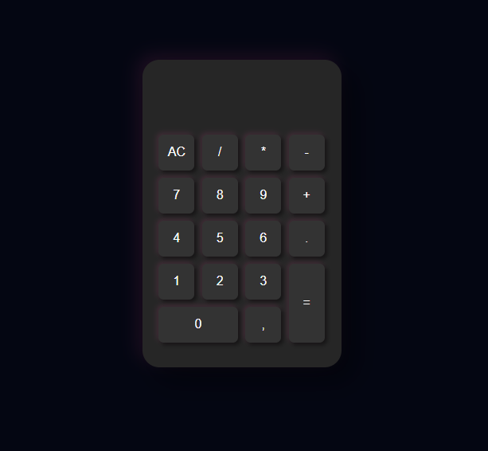
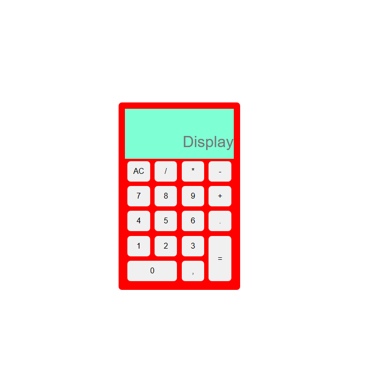

# 🧮​ Calculadora (sabor gamer 🤭​) 🧮​

Este é um projeto de uma calculadora desenvolvida com HTML, JavaScript e estilizada com CSS, com o objetivo de praticar fundamentos da programação web, manipulação do DOM e a utilização do CSS Grid Layout.

## 📷​ Preview



_tá meio feinha agora, mas vai dar certo_

# 📊​ Status do Projeto

<p align="center">

</p>

## 🎯​ Objetivo do Projeto

Este projeto foi criado com fins educacionais, para praticar os conceitos de:

- Manipulação de eventos;
- Operações matemáticas com eval();
- Organização do código de front-end
- Estilização com CSS Grid Layout

## ​🛠️​​ Funcionalidades

- Operações matemáticas básicas (adição, subtração, multiplicação e divisão)
- Interface com estética semelhante à de um teclado numérico com RGB
- Feedback visual nas interações
- Botão "AC" para limpar o display
- Suporte ao separador decimal ","
- Layout responsivo

## 💻​ Tecnologias Utilizadas

<p align="center">
  
</p>

- **HTML5** - Estrutura da página
- **CSS3** - estilização e layout
- ** JavaScript** - lógica das funcões da calculadora

## ​🗂️​ Estrutura do projeto

```
calculadora-gamer/
├── img/
│   └── image.png
├── index.html
├── style.css
└── script.js
```

## 🔎​ Como Executar o Projeto

1. Clone o repositório

```bash
git clone https://github.com/pbLola/calculadora-gamer
```

2. Abra o index.html no navegador

   Sem instalação, sem dependências. ✔️

## ​⭐ Versões e Atualizações

<table>
    <tr>
        <td> <h3>v1.0 — 08/06/2026</h3></td>
        <td><h3>v1.2 — 08/06/2026</h3> </td>
        <td> <h3> </h3></td>
        <td><h3></h3> </td>
    </tr>
    <tr>
        <td></td>
        <td></td> 
        <td> </td>
    </tr>
    <tr>
        <td><p>Criação da Calculadora</p></td> 
        <td><p>Aplicação de Estilo Neumorphic</p></td> 
        <td><p></p></td>
</tr>
</table>

## 🙋🏽‍♀️​ A Autora

**Lohanne Castro Oliveira**

[](https://www.linkedin.com/in/lohanne-castro-oliveira/)
[](https://github.com/pbLola)

Feedbacks e sugestões são sempre bem-vindos! 🧡​

## 📝Licença

Este projeto é de uso educacional.
© 2026 Lohanne Castro Oliveira — Todos os direitos reservados.
